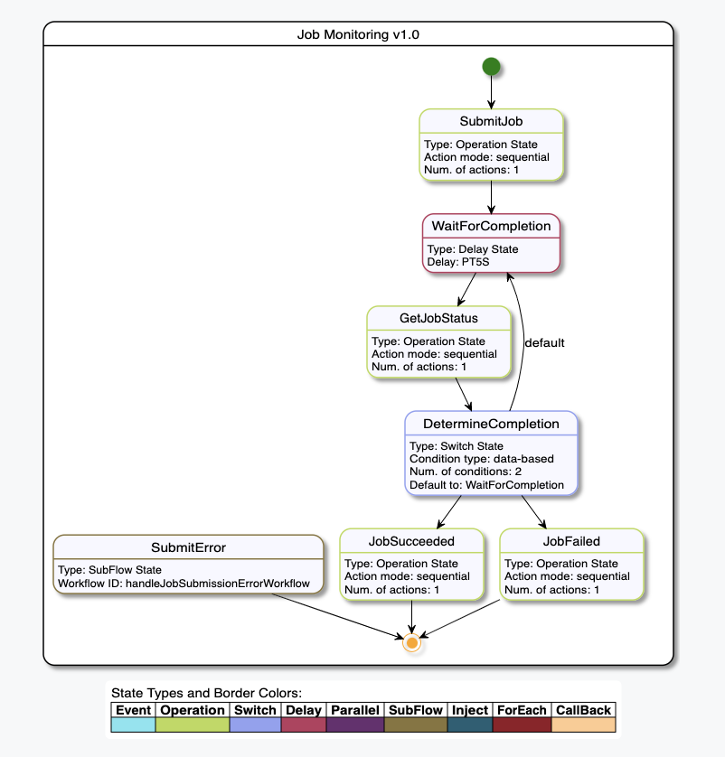
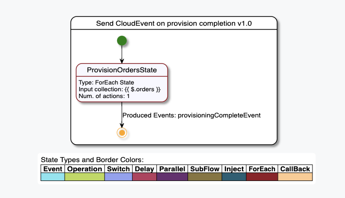

 [](https://gitpod.io/#https://github.com/serverlessworkflow/sdk-java)

# Serverless Workflow Specification - Java SDK

Provides the Java API/SPI and Model Validation for the [Serverless Workflow Specification](https://github.com/serverlessworkflow/specification)

With the SDK you can:

* Parse workflow JSON and YAML definitions
* Programmatically build workflow definitions
* Validate workflow definitions (both schema and workflow integrity validation)
* Generate workflow diagram (SVG)

Serverless Workflow Java SDK is **not** a workflow runtime implementation but can be used by Java runtime implementations
to parse and validate workflow definitions as well as generate the workflow diagram (SVG).

### Status

| Latest Releases | Conformance to spec version |
| :---: | :---: |
| [3.0.0.Final](https://github.com/serverlessworkflow/sdk-java/releases/) | [v0.7](https://github.com/serverlessworkflow/specification/tree/0.7.x) |
| [2.0.0.Final](https://github.com/serverlessworkflow/sdk-java/releases/) | [v0.6](https://github.com/serverlessworkflow/specification/tree/0.6.x) |
| [1.0.3.Final](https://github.com/serverlessworkflow/sdk-java/releases/) | [v0.5](https://github.com/serverlessworkflow/specification/tree/0.5.x) |

### Getting Started

#### Building locally

To build project and run tests locally:

```
git clone https://github.com/serverlessworkflow/sdk-java.git
mvn clean install
```

To use it in your projects you can:

#### Maven projects:

a) Add the following repository to your pom.xml `repositories` section:

```xml
<repository>
    <id>oss.sonatype.org-snapshot</id>
    <url>http://oss.sonatype.org/content/repositories/snapshots</url>
    <releases>
        <enabled>false</enabled>
    </releases>
    <snapshots>
        <enabled>true</enabled>
    </snapshots>
</repository>
```

b) Add the following dependencies to your pom.xml `dependencies` section:

```xml
<dependency>
    <groupId>io.serverlessworkflow</groupId>
    <artifactId>serverlessworkflow-api</artifactId>
    <version>4.0.0-SNAPSHOT</version>
</dependency>

<dependency>
    <groupId>io.serverlessworkflow</groupId>
    <artifactId>serverlessworkflow-spi</artifactId>
    <version>4.0.0-SNAPSHOT</version>
</dependency>

<dependency>
    <groupId>io.serverlessworkflow</groupId>
    <artifactId>serverlessworkflow-validation</artifactId>
    <version>4.0.0-SNAPSHOT</version>
</dependency>

<dependency>
    <groupId>io.serverlessworkflow</groupId>
    <artifactId>serverlessworkflow-diagram</artifactId>
    <version>4.0.0-SNAPSHOT</version>
</dependency>
```

#### Gradle projects:

a) Add the following repositories to your build.gradle `repositories` section:

```text
maven { url "https://oss.sonatype.org/content/repositories/snapshots" }
```

b) Add the following dependencies to your build.gradle `dependencies` section:

```text
implementation("io.serverlessworkflow:serverlessworkflow-api:4.0.0-SNAPSHOT")
implementation("io.serverlessworkflow:serverlessworkflow-spi:4.0.0-SNAPSHOT")
implementation("io.serverlessworkflow:serverlessworkflow-validation:4.0.0-SNAPSHOT")
implementation("io.serverlessworkflow:serverlessworkflow-diagram:4.0.0-SNAPSHOT")
```

### How to Use 

#### Creating from JSON/YAML source

You can create a Workflow instance from JSON/YAML source:

Let's say you have a simple YAML based workflow definition:

```yaml
id: greeting
version: '1.0'
name: Greeting Workflow
start: Greet
description: Greet Someone
functions:
  - name: greetingFunction
    operation: file://myapis/greetingapis.json#greeting
states:
- name: Greet
  type: operation
  actions:
  - functionRef:
      refName: greetingFunction
      arguments:
        name: "${ .greet.name }"
    actionDataFilter:
      results: "${ .payload.greeting }"
  stateDataFilter:
    output: "${ .greeting }"
  end: true
```

To parse it and create a Workflow intance you can do:

``` java
Workflow workflow = Workflow.fromSource(source);
```

where 'source' is the above mentioned YAML definition.

The fromSource static method can take in definitions in both JSON and YAML formats.

Once you have the Workflow instance you can use its API to inspect it, for example:

``` java
assertNotNull(workflow);
assertEquals("greeting", workflow.getId());
assertEquals("Greeting Workflow", workflow.getName());

assertNotNull(workflow.getFunctions());
assertEquals(1, workflow.getFunctions().size());
assertEquals("greetingFunction", workflow.getFunctions().get(0).getName());

assertNotNull(workflow.getStates());
assertEquals(1, workflow.getStates().size());
assertTrue(workflow.getStates().get(0) instanceof OperationState);

OperationState operationState = (OperationState) workflow.getStates().get(0);
assertEquals("Greet", operationState.getName());
assertEquals(DefaultState.Type.OPERATION, operationState.getType());
...
```

#### Using builder API

You can also programmatically create Workflow instances, for example:

``` java
Workflow workflow = new Workflow()
                .withId("test-workflow")
                .withName("test-workflow-name")
                .withVersion("1.0")
                .withStart(new Start().withStateName("MyDelayState"))
                .withFunctions(new Functions(Arrays.asList(
                        new FunctionDefinition().withName("testFunction")
                                .withOperation("testSwaggerDef#testOperationId")))
                )
                .withStates(Arrays.asList(
                        new DelayState().withName("MyDelayState").withType(DELAY)
                                .withTimeDelay("PT1M")
                                .withEnd(
                                        new End().withTerminate(true)
                                )
                        )
                );
```

This will create a test workflow that defines an event, a function and a single Delay State.

You can use the workflow instance to get its JSON/YAML definition as well:

``` java
assertNotNull(Workflow.toJson(testWorkflow));
assertNotNull(Workflow.toYaml(testWorkflow));
```

#### Using Workflow Validation

Validation allows you to perform Json Schema validation against the JSON/YAML workflow definitions.
Once you have a `Workflow` instance, you can also run integrity checks.

You can validate a Workflow JSON/YAML definition to get validation errors:

``` java
WorkflowValidator workflowValidator = new WorkflowValidatorImpl();
List<ValidationError> validationErrors = workflowValidator.setSource("WORKFLOW_MODEL_JSON/YAML").validate();
```

Where `WORKFLOW_MODEL_JSON/YAML` is the actual workflow model JSON or YAML definition.

Or you can just check if it is valid (without getting specific errors):

``` java
WorkflowValidator workflowValidator = new WorkflowValidatorImpl();
boolean isValidWorkflow = workflowValidator.setSource("WORKFLOW_MODEL_JSON/YAML").isValid();
```

If you build your Workflow programmatically, you can validate it as well:

``` java
Workflow workflow = new Workflow()
                .withId("test-workflow")
                .withVersion("1.0")
                .withStart(new Start().withStateName("MyDelayState"))
                .withStates(Arrays.asList(
                        new DelayState().withName("MyDelayState").withType(DefaultState.Type.DELAY)
                                .withTimeDelay("PT1M")
                                .withEnd(
                                        new End().withTerminate(true)
                                )
                ));
);

WorkflowValidator workflowValidator = new WorkflowValidatorImpl();
List<ValidationError> validationErrors = workflowValidator.setWorkflow(workflow).validate();
```

#### Building Workflow Diagram

Given a valid workflow definition (JSON/YAML) or a Workflow object you can build the workflow diagram SVG.
The generated diagram SVG uses [PlantUML](https://plantuml.com/) state diagram visualization and can be embedded inside your 
tooling or web pages, or any SVG viewer.

You can build the workflow diagram SVG with the following code:

``` java
Workflow workflow = Workflow.fromSource(source);

WorkflowDiagram workflowDiagram = new WorkflowDiagramImpl();
workflowDiagram.setWorkflow(workflow);

String diagramSVG = workflowDiagram.getSvgDiagram();
```

`diagramSVG` includes the diagram SVG source which you can then decide to save to a file, 
print, or process further.

By default the diagram legend is now shown. If you want to enable it you can do:

``` java
Workflow workflow = Workflow.fromSource(source);

WorkflowDiagram workflowDiagram = new WorkflowDiagramImpl();
workflowDiagram.setWorkflow(workflow)
               .showLegend(true);

String diagramSVG = workflowDiagram.getSvgDiagram();
```

Here are some generated diagrams from the specification examples (with legend enabled):

1. [Job Monitoring Example](https://github.com/serverlessworkflow/specification/blob/master/examples/examples.md#Monitor-Job-Example)
<p align="center">

</p>


2. [Send CloudEvent on Workflow completion Example](https://github.com/serverlessworkflow/specification/blob/master/examples/examples.md#send-cloudevent-on-workfow-completion-example)
<p align="center">

</p>
