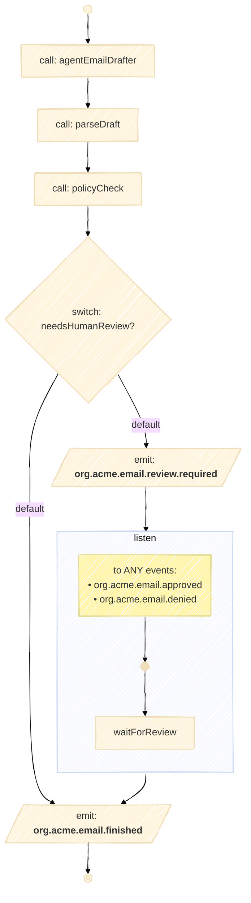

# CNCF Serverless Workflow SDK Java — Agentic DSL

## What is the DSL?

This module uses the **CNCF Workflow Specification Java Fluent DSL (DSL 1.0.0, tasks‑based)**. It’s a **strongly‑typed, builder‑style API** for composing workflows in Java while staying faithful to the CNCF spec’s execution model and event semantics.

**Core ideas:**

* **Tasks first.** Compose first‑class **tasks** (sequence/branches) rather than legacy “states”.
* **Fluent builders.** Typed verbs guide valid configurations:

    * `agent(id, Agents.Foo)` — call an LLM/agent and capture outputs via `outputName`.
    * `callFn(id, c -> c.function(MethodRef, ArgClass))` — call **pure Java functions** with static typing.
    * `switchCase(id, s -> …)` — branch with **typed predicates** and `onDefault(...)`.
    * `emit(id, e -> e.event(...))` — publish **CloudEvents** with typed payload marshalling.
    * `listen(id, l -> l.to(e -> e.any(...) / e.all(...)))` — **wait** for one or more events before continuing.
* **Event‑native.** **CloudEvents** are the wire model for `emit`/`listen`, keeping components loosely coupled.
* **Agentic‑AI friendly.** Agents are first‑class tasks; outputs flow into functions and policies naturally.
* **Embeddable runtime.** `WorkflowApplication` runs definitions **in‑process** (great for tests/services).
* **Type‑safe data flow.** Inputs/outputs keep their static types (e.g., `PolicyDecision.class`).

> [!NOTE]
> **Module layering & mix‑and‑match**
>
> ```
> spec  →  func  →  agentic
> ```
>
> * **`spec`** — CNCF‑only core (workflows, tasks, events)
> * **`func`** — adds **Java function calls** & **predicate branching** on top of `spec`
> * **`agentic`** — adds **LangChain4j agent calls** on top of `func` + `spec`
>
> Because of this hierarchy, you can **freely mix** `agent(...)` with core CNCF tasks and Java `callFn(...)`/`switchCase(...)` in the same workflow.

---

## Email Drafter Agentic Workflow (use case)

> [!NOTE]
> The full integration test can be seen in [src/test/java/io/serverlessworkflow/fluent/agentic/EmailDrafterIT.java]().

**What it does:**
Drafts an email with an agent, **parses** it, runs a **policy check**, and either:

* **Auto‑marks the email as ready**, or
* **Requests human review** and **waits** for an approval/denial event.

**Main steps:**

1. **`agentEmailDrafter`** – `Agents.EmailDrafter` → `email_draft`
2. **`parseDraft`** – `EmailDrafts::parse(String)` → `EmailDraft`
3. **`policyCheck`** – `EmailPolicies::policyCheck(EmailDraft)` → `PolicyDecision`
4. **`needsHumanReview?`** – if decision ≠ `AUTO_SEND`: emit **`org.acme.email.review.required`** and **listen** for `org.acme.email.approved` **or** `org.acme.email.denied`
5. **`emailFinished`** – emit **`org.acme.email.finished`**

**Mermaid view (generated with our Mermaid library):**



---

## Human‑in‑the‑Loop (HITL) in Java Enterprise: Why & How

**Why HITL matters:** In real organizations, certain actions must be **reviewed or approved by a person** before they’re executed. Reasons include compliance (SOX, GDPR/PII), brand/reputation risk, contractual obligations, or simply to protect end‑users. With this DSL you can **codify those gates** while keeping the rest fully automated.

### What the Email Drafter workflow demonstrates

* **Risk‑based gating.** A policy converts the draft into a `PolicyDecision`. If risk is low → `AUTO_SEND`; else we **emit** `org.acme.email.review.required` and **listen** for approval/denial.
* **Asynchronous review.** Business users can take minutes or hours. The workflow stays **durably waiting** via `listen(...any(...))` and resumes when an event arrives.
* **Auditable trail.** Every `emit`/`listen` edge is a CloudEvent, so you get a clear audit trail: *who* approved, *when*, and *what* changed.

### Where this shines in Java enterprise apps

* **Customer communications & CRM.** Outbound emails, quotes, and renewals requiring manager/legal sign‑off.
* **Procurement & finance.** PO creation, vendor onboarding, invoice disputes, refunds above threshold.
* **HR & legal.** Offer letters, policy updates, external statements that need counsel approval.
* **ITSM & DevOps.** Change approvals (CAB), production runbooks that pause for human confirmation.
* **Healthcare & insurance.** Sensitive messaging that must be clinician/adjuster‑approved.
* **Marketing & brand.** Campaign copy generation with brand/compliance review before release.

### A typical HITL architecture (event‑native)

1. **Workflow emits** `org.acme.email.review.required` with a correlation key (e.g., `data.workflowInstanceId`).
2. **A reviewer UI** (React/Angular) lists pending items by reading from Kafka/AMQP or via a service (
   Quarkus/Spring) that projects CloudEvents into a DB.
3. Reviewer **approves/denies** → UI calls a webhook
   (`POST /events/decisions`) that **publishes** a CloudEvent:

    * `org.acme.email.approved` **or** `org.acme.email.denied`
    * includes the same correlation key so the waiting `listen` matches
4. Workflow **resumes** and continues to `emailReady` or an alternate path.

> [!TIP]
> Use CloudEvents attributes like `subject` (correlation), `type` (routing), and `time` (auditing). Store the event IDs to ensure **idempotency** if a reviewer double‑clicks.

### Example approval payload (conceptual)

```json
{
  "type": "org.acme.email.approved",
  "subject": "wf:emailDrafterAgentic:2b9ee...",
  "data": {
    "approvedBy": "jdoe",
    "comments": "Looks good; added calendar link.",
    "redactions": ["phoneNumber"],
    "version": 3
  }
}
```

### Production considerations & best practices

* **Timeouts & escalation.** Add a timer branch (SLA breach → notify Slack/Jira or fall back to a safe default).
* **Policy engines.** Externalize complex rules with **OPA** or a Java rules engine; keep `policyCheck` deterministic and testable.
* **PII/redaction gates.** Run a redaction/safety step before approvals (PII scans, external domain checks, prompt‑injection guards).
* **RBAC & separation of duties.** Ensure the reviewer isn’t the same person who drafted (auditors love this).
* **Observability.** Emit metrics on time‑to‑approve, auto‑send rate, denial reasons; add tracing across `emit`/`listen`.
* **Idempotency & retries.** Use event IDs and outbox/inbox patterns with Kafka/AMQP to avoid duplicate advances.
* **Versioning.** Include draft `version` in events; if the text changed during review, request re‑approval.

### Extending the pattern

* **Multi‑stage approvals.** Chain multiple `listen` steps (e.g., manager → legal → compliance) with `any/all` strategies.
* **Conditional reviewers.** Route to different queues based on region/domain or risk score.
* **Partial automation.** Allow **auto‑send** for internal domains but require approval for external ones (`allowedDomains`).
* **A/B safety.** Run two agents (draft + safety critique) before human review; only request HITL if they disagree.

This approach gives teams the **best of both worlds**: fast, LLM‑assisted generation with **governed, observable checkpoints** that fit naturally into Java enterprise stacks (Quarkus/Spring, JPA, Kafka/AMQP, REST/WebSockets) and compliance programs.

---

## Maven setup (single dependency)
 
**For application projects** a **single dependency** is enough. The `agentic` module brings the required transitive bits for you (core spec, func layer, runtime, etc.).

Requires **Java 17+**.

```xml
<dependency>
  <groupId>io.serverlessworkflow</groupId>
  <artifactId>serverlessworkflow-experimental-fluent-agentic</artifactId>
  <version>YOUR_VERSION</version>
</dependency>
```

> [!TIP]
> You can still mix `agent(...)` calls with `callFn(...)`, `switchCase(...)`, `emit(...)`, and `listen(...)` in the same workflow thanks to the `spec → func → agentic` layering.
