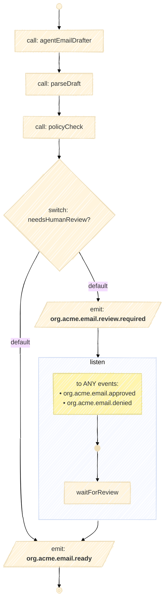

# Email Drafter – Java Fluent DSL Example

## 1) What is the DSL?

This module uses the **CNCF Workflow Specification Java Fluent DSL (DSL 1.0.0, tasks‑based)**. It’s a **strongly‑typed, builder‑style API** for composing workflows in Java while staying faithful to the CNCF spec’s execution model and event semantics.

**Core ideas:**

* **Tasks first.** Compose first‑class **tasks** (sequence/branches) rather than legacy “states”.
* **Fluent builders.** Typed verbs guide valid configurations:

    * `agent(id, Agents.Foo)` — call an LLM/agent and capture outputs via `outputName`.
    * `callFn(id, c -> c.function(MethodRef, ArgClass))` — call **pure Java functions** with static typing.
    * `switchCase(id, s -> …)` — branch with **typed predicates** and `onDefault(...)`.
    * `emit(id, e -> e.event(...))` — publish **CloudEvents** with typed payload marshalling.
    * `listen(id, l -> l.to(e -> e.any(...) / e.all(...)))` — **wait** for one or more events before continuing.
* **Event‑native.** **CloudEvents** are the wire model for `emit`/`listen`, keeping components loosely coupled.
* **Agentic‑AI friendly.** Agents are first‑class tasks; outputs flow into functions and policies naturally.
* **Embeddable runtime.** `WorkflowApplication` runs definitions **in‑process** (great for tests/services).
* **Type‑safe data flow.** Inputs/outputs keep their static types (e.g., `PolicyDecision.class`).

> \[!NOTE]
> **Module layering & mix‑and‑match**
>
> ```
> spec  →  func  →  agentic
> ```
>
> * **`spec`** — CNCF‑only core (workflows, tasks, events)
> * **`func`** — adds **Java function calls** & **predicate branching** on top of `spec`
> * **`agentic`** — adds **LangChain4j agent calls** on top of `func` + `spec`
>
> Because of this hierarchy, you can **freely mix** `agent(...)` with core CNCF tasks and Java `callFn(...)`/`switchCase(...)` in the same workflow.

---

## 2) Email Drafter Agentic Workflow (use case)

**What it does:**
Drafts an email with an agent, **parses** it, runs a **policy check**, and either:

* **Auto‑marks the email as ready**, or
* **Requests human review** and **waits** for an approval/denial event.

**Main steps:**

1. **`agentEmailDrafter`** – `Agents.EmailDrafter` → `email_draft`
2. **`parseDraft`** – `EmailDrafts::parse(String)` → `EmailDraft`
3. **`policyCheck`** – `EmailPolicies::policyCheck(EmailDraft)` → `PolicyDecision`
4. **`needsHumanReview?`** – if decision ≠ `AUTO_SEND`: emit **`org.acme.email.review.required`** and **listen** for `org.acme.email.approved` **or** `org.acme.email.denied`
5. **`emailReady`** – emit **`org.acme.email.ready`**

**Mermaid view (generated with our Mermaid library):**



---

## 3) Maven setup (single dependency)

> **For application projects** a **single dependency** is enough. The `agentic` module brings the required transitive bits for you (core spec, func layer, runtime, etc.).
>
> Requires **Java 17+**.

```xml
<dependency>
  <groupId>io.serverlessworkflow</groupId>
  <artifactId>serverlessworkflow-experimental-fluent-agentic</artifactId>
  <version>YOUR_VERSION</version>
</dependency>
```

> \[!TIP]
> You can still mix `agent(...)` calls with `callFn(...)`, `switchCase(...)`, `emit(...)`, and `listen(...)` in the same workflow thanks to the `spec → func → agentic` layering.

---
