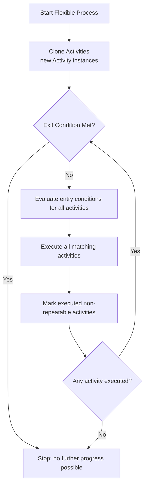

# Flexible Process — Dynamic, Condition-Driven Task Execution for Serverless Workflow

`FlexibleProcess` is an extension for **Serverless Workflow** that enables execution of a set
of activities where:

- the **order is not predefined**,
- activities run only when their **entry conditions** are satisfied,
- execution continues until an **exit condition** evaluates to true,
- activities can be **repeatable** or **single-run**,
- a process may contain **many activities** working together like a rule engine.

This allows modeling dynamic, state-driven workflows not possible in linear step-based systems.

---

## Why Flexible Process?

Traditional workflow engines follow a static sequence of tasks.  
However, real business logic often requires:

- executing a task only when certain data becomes available,
- skipping tasks dynamically,
- repeating tasks until a business rule is met,
- enabling tasks conditionally,
- mixing multiple independent “microsteps” that coordinate through shared state,

`FlexibleProcess` provides exactly this capability.

---

## Core Concepts

### **Activity**

An `Activity` is a small executable unit consisting of:

- **task** — the business logic (Java function, service call, etc.)
- **entryCondition** — predicate that decides whether this activity should run
- **isRepeatable** — whether the activity may run more than once
- **postAction** — (optional) callback after execution
- **executed flag** (internal, per-run)

Example:

```java
Activity increment =
    Activity.builder()
        .callTask(consumer(map -> {
            int counter = (int) map.get("counter");
            map.put("counter", counter + 1);
        }, Map.class))
        .entryCondition(model -> true)
        .isRepeatable(true)
        .build();
```

# FlexibleProcess

A **Flexible Process** is a group of activities executed in a loop: all activities check their entry conditions each iteration, those that match execute, loop stops when the `exitCondition` is met or when `maxAttempts` is reached.

```java
FlexibleProcess process = FlexibleProcess.builder()
    .exitCondition(model -> (int) model.asMap().get().get("counter") >= 3)
    .activities(increment)
    .build();
```

You can attach:
- `onProcessFinished`
- `onException`
- `maxAttempts`

## Running a Simple Flexible Process

### 1. Define an activity

```java
Activity increment = Activity.builder()
    .callTask(consumer(map -> {
        int value = (int) map.get("value");
        map.put("value", value + 1);
    }, Map.class))
    .entryCondition(model -> true)
    .isRepeatable(true)
    .build();
```

### 2. Define exit condition

```java
Predicate<WorkflowModel> done = model -> 
    (int) model.asMap().get().get("value") >= 5;
```

### 3. Build the FlexibleProcess

```java
FlexibleProcess flexible = FlexibleProcess.builder()
    .exitCondition(done)
    .activities(increment)
    .maxAttempts(100)
    .build();
```

### 4. Insert into workflow

```java
    Workflow workflow =
        FuncWorkflowBuilder.workflow("flex-demo")
                .tasks(process("flex_proc", flexible))
                .build();
```

### 5. Execute

```java
try (WorkflowApplication app = WorkflowApplication.builder().build()) {
    Map<String, Object> result = app.workflowDefinition(workflow)
        .instance(Map.of("value", 0))
        .start()
        .get()
        .asMap()
        .orElseThrow();
    
    System.out.println(result); // prints {value=5}
}
```

## Advanced Example: Multi-Activity Dynamic Flow

```java
Activity doubler = Activity.builder()
    .callTask(consumer(map -> {
        int v = (int) map.get("value");
        map.put("value", v * 2);
    }, Map.class))
    .entryCondition(model -> 
        ((int) model.asMap().get().get("value")) < 50)
    .isRepeatable(true)
    .build();

Activity subtract = Activity.builder()
    .callTask(consumer(map -> {
        int v = (int) map.get("value");
        map.put("value", v - 5);
    }, Map.class))
    .entryCondition(model -> 
        ((int) model.asMap().get().get("value")) >= 50)
    .isRepeatable(true)
    .build();

FlexibleProcess process = FlexibleProcess.builder()
    .exitCondition(model -> 
        (int) model.asMap().get().get("value") < 10)
    .activities(doubler, subtract)
    .build();
```

This process:
- Doubles value until it reaches 50
- Then repeatedly subtracts 5
- Stops when result < 10

A perfect example of **non-linear, state-driven execution**.

## Use Cases

### Rule-Based Decision Logic
- document validation
- scoring & risk models
- conditional enrichment
- fraud detection pipelines

### Iterative / Loop-Based Processing
- stabilization loops
- retries with state transitions
- multi-step data transformations

## Execution Model

