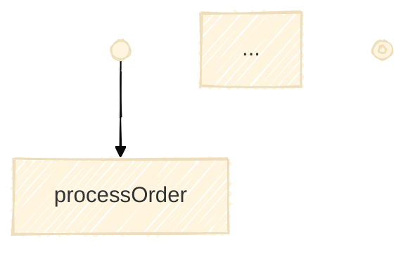
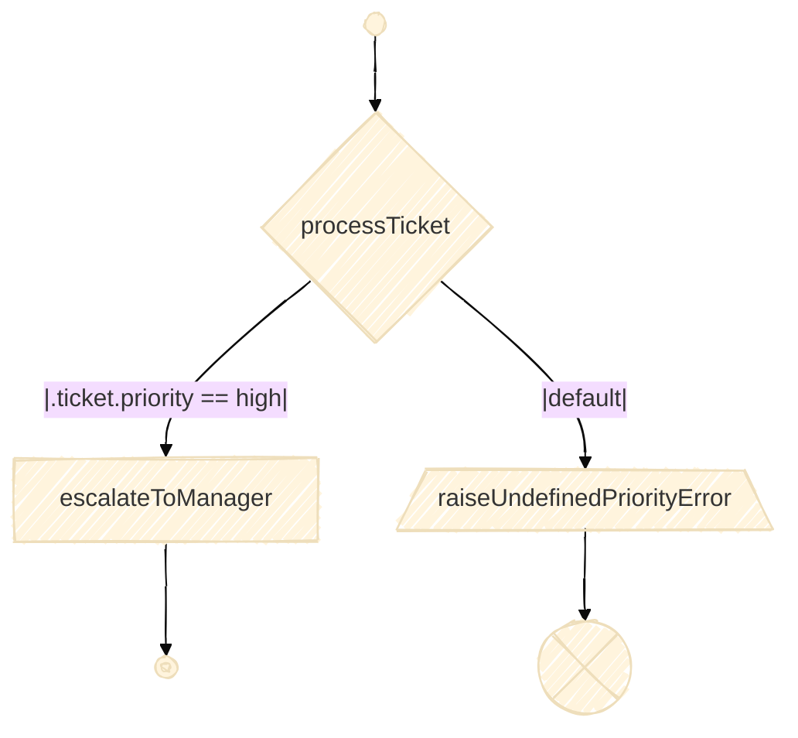

# serverlessworkflow-mermaid

Generate **Mermaid** diagrams for [Serverless Workflow](https://serverlessworkflow.io/) definitions.
This library turns a `Workflow` into a Mermaid **flowchart**, with sensible shapes and wiring for common DSL constructs, and can optionally export **SVG/PNG** via a lightweight HTTP helper.

---

## Features

* **One-liner:** `new Mermaid().from(workflow)` → Mermaid string
* **Deterministic node IDs** (stable diffs / snapshots)
* **Start/End terminals** and distinct **Error terminal** for `raise`
* Supports:

    * `do` (sequences)
    * `call`, `set`, `run`, `emit`, `wait`, `listen`
    * `for` (loop subgraph with loopback)
    * `try/catch` (nested subgraphs)
    * `fork` (split/join with `ALL` or `ANY` depending on `compete`)
    * `switch` (fan-out with labeled edges)
    * `raise` (terminates at `__error`)
* Optional **image export** to SVG/PNG (no Node.js required) using `MermaidInk.render(...)`

---

## Installation

Add the dependency to the module where you want to render diagrams.

<details>
<summary>Maven</summary>

```xml
<dependency>
  <groupId>io.serverlessworkflow</groupId>
  <artifactId>serverlessworkflow-mermaid</artifactId>
  <version>YOUR_VERSION</version>
</dependency>
```

</details>

<details>
<summary>Gradle (Kotlin)</summary>

```kotlin
implementation("io.serverlessworkflow:serverlessworkflow-mermaid:YOUR_VERSION")
```

</details>

> This library depends on `serverlessworkflow-api` to read/construct workflows.

---

## Quick start

### 1) From a `Workflow` instance

```java
import io.serverlessworkflow.api.types.Workflow;
import io.serverlessworkflow.mermaid.Mermaid;

Workflow wf = /* build or load your workflow */;
String mermaid = new Mermaid().from(wf);
// paste into any Mermaid renderer/editor or export (see below)
System.out.println(mermaid);
```

### 2) From a YAML on the classpath

```java
import io.serverlessworkflow.mermaid.Mermaid;

String mermaid = new Mermaid().from("workflows/sample.yaml");
```

The output includes a small config header and the `flowchart TD` graph:



> The header is currently fixed; a future builder will make it customizable.

---

## Export to SVG/PNG (optional)

Use the built-in `MermaidInk` helper (HTTP call to mermaid.ink):

```java
import java.nio.file.Path;
import io.serverlessworkflow.mermaid.Mermaid;
import io.serverlessworkflow.mermaid.MermaidInk;

String mermaid = new Mermaid().from("workflows/sample.yaml");

// SVG
MermaidInk.render(mermaid, /*svg=*/true,  Path.of("diagram.svg"));
// PNG
MermaidInk.render(mermaid, /*svg=*/false, Path.of("diagram.png"));
```

**Notes**

* Requires network access to `https://mermaid.ink/`.
* Throws a `RuntimeException` on HTTP failure or file write issues.

**Alternatives**

* Run the official Mermaid CLI in a build step (`@mermaid-js/mermaid-cli`, Node).
* Use a diagram service such as Kroki (HTTP) if you prefer a self-hosted renderer.

---

## Shapes & semantics (at a glance)

* `n__start__` → small circle (`sm-circ`)
* `n__end__` → stop (`stop`)
* Simple tasks (`call`, `set`, `run`, `emit`, etc.) → `rect` (or a more specific shape where mapped)
* `for` → subgraph containing:
    * a note with `each / in / at`
    * a `loop` junction and a dashed `next` loopback (optional `while` label)
* `try/catch` → subgraph with `Try` and `Catch` nested subgraphs
* `fork` → subgraph with a split badge (`fork`) and a join badge labeled `ALL` or `ANY`
* `switch` → decision-like node with **labeled edges** for each case (including `default`)
* `raise` → distinct node that **terminates at `n__error__`** unless explicitly redirected

All node labels are **escaped** for Mermaid (e.g., `[` `]` and line breaks), and IDs are **deterministic** (derived from task names/scope) so diagrams are stable across runs.

---

## Example (switch + raise)

**Workflow YAML**

```yaml
do:
  - processTicket:
      switch:
        - highPriority:
            when: .ticket.priority == "high"
            then: escalateToManager
        - default:
            then: raiseUndefinedPriorityError
  - escalateToManager:
      set:
        status: escalated
      then: exit
  - raiseUndefinedPriorityError:
      raise:
        error:
          type: https://fake/errors/undefined-priority
          status: 400
```

**Rendered (excerpt)**



---

## FAQ

**Can I change the look/theme?**
Not yet; the header uses `handDrawn` + `base`. A config builder is planned. You can always prepend your own header before rendering/export.

**Are IDs stable?**
Yes. IDs are derived from task names (plus scope) with a short hash. Helper nodes (notes/loop/join) derive from the parent ID.

**How do I add a custom task shape?**
Extend the existing `Node`/`NodeBuilder` pattern and map your class to a `NodeType`/shape. The graph builder is designed for specialized node subclasses.
